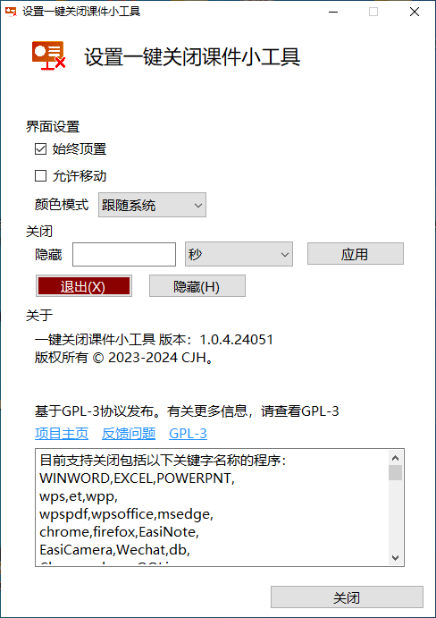

<h1 align="center">
  TDocKiller - 一键关闭课件小工具
</h1>

## 关于本项目

这是一个一款为方便在下课时迅速关闭课件而开发的工具。本软件可以安装在大屏上（例如教学大屏），也可以安装在普通电脑上。

## 功能

本程序支持的功能有：

- [x] 关闭课件（基础功能）
- [x] 深浅色模式
- [x] 支持通过组策略配置策略
- [x] 支持保存你的设置
- [x] 适配DPI缩放（适配高分屏）

## 下载

转到[发布页](https://github.com/cjhdevact/TDocKiller/releases/latest)下载程序或源代码。

早期版本的源代码也在发布页里。

## 程序截图

主程序界面

横向：

      

纵向：

      

设置界面

## 开源说明

在修改和由本仓库代码衍生的代码中需要说明“基于 TDocKiller 开发”。

## 相关项目

[UsefulControl](https://github.com/cjhdevact/UsefulControl) - 实用小工具的整合项目（包括本项目的功能）

## License

本程序基于`GPL-3.0`协议授权。