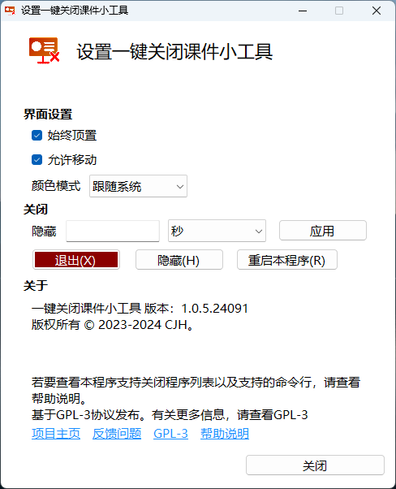

<h1 align="center">
  <a href="https://github.com/cjhdevact/TDocKiller">TDocKiller - 一键关闭课件小工具</a>
</h1>

## 关于本项目

这是一个一款为方便在下课时迅速关闭课件而开发的工具。本软件可以安装在大屏上（例如教学大屏），也可以安装在普通电脑上。

## 功能

本程序支持的功能有：

- [x] 关闭课件（基础功能）
- [x] 深浅色模式
- [x] 支持通过组策略配置策略
- [x] 支持保存你的设置
- [x] 适配DPI缩放（适配高分屏）

## 数字签名

本程序使用了自签证书进行了签名

证书信息：
```
Name: CJH Root Certificate
Create: ‎2024‎年‎12‎月‎27‎日 20:42:16
Expires: ‎2150‎年‎12‎月‎31‎日 0:00:003e5
MD5: 0bc507db70947e57ddd81bec63b581d9
SHA256: d2d67c8ebea3cc954c7ee0e94f5f45537dde7709053ca9e89f352fda60283
Key fingerprint (SHA1): 73b80a8d0ba3f662b575f2fc0b78612469e22e59
KeyID: d929e453f645017190dac5001a736a4d
Certificate SerialNumber: dbde77418068d5a34b2064626a12ecde
Key Type: md5RSA
```

你可以在[这里](Src/TDocKiller/files/rootcert.cer)下载证书来验证程序完整性。

## 下载

转到[发布页](https://github.com/cjhdevact/TDocKiller/releases/latest)下载程序或源代码。

早期版本的源代码也在发布页里。

## 程序截图

主程序界面

横向：

      

纵向：

      

设置界面



## 开源说明

在修改和由本仓库代码衍生的代码中需要说明“基于 TDocKiller 开发”。

## 相关项目

[UsefulControl](https://github.com/cjhdevact/UsefulControl) - 实用小工具的整合项目（包括本项目的功能）

## License

本程序基于`GPL-3.0`协议授权。